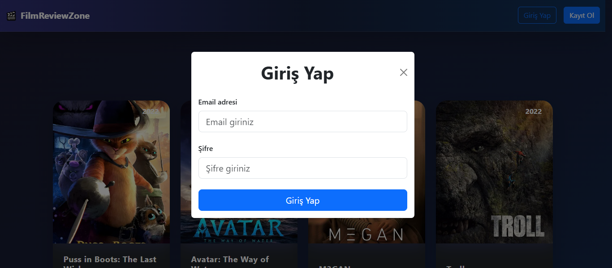
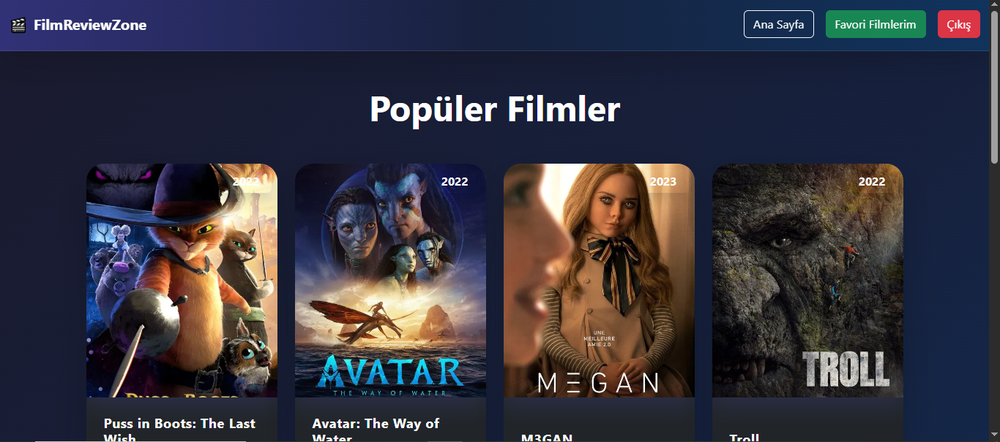
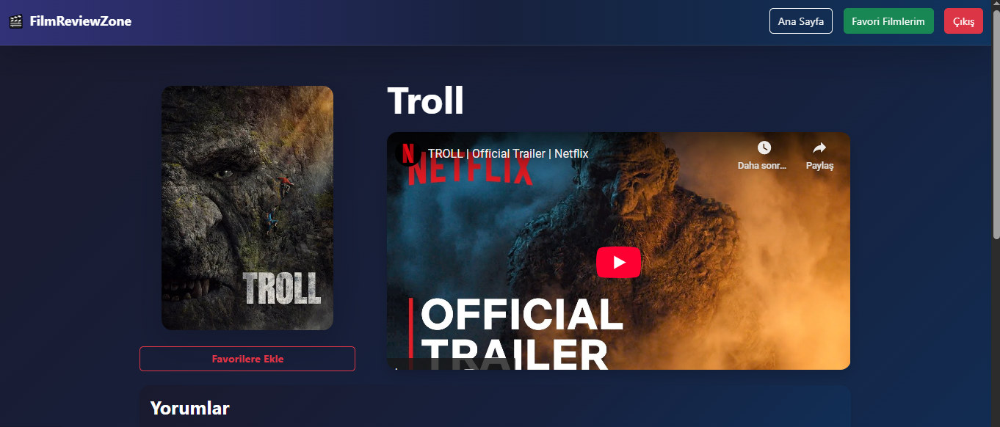

# FilmReviewZone

## About the Project
FilmReviewZone is a modern web application where users can browse popular movies, view detailed information, manage their favorite films, and write reviews. Users can register, log in, add or remove favorite movies, and rate and comment on films.

## Main Features
- **User Authentication:**
  - Users can register and log in with their email and password.
  - Logged-in users can manage their favorite movies and reviews.

- **Movie Listing:**
  - The homepage displays a list of popular movies.
  - Each movie card shows the poster and title.
  - If a non-logged-in user tries to view movie details, they are prompted to log in.

- **Movie Details & Reviews:**
  - Each movie has a detail page with its poster, slogan, trailer, and user reviews.
  - Logged-in users can rate and comment on movies.
  - Reviews are displayed with the user's email, content, and rating.

- **Favorite Movies:**
  - Users can add or remove movies from their favorites.
  - Favorite movies are listed on a separate page, and users can navigate to their details.

## User Flow
1. **Login/Registration:**
   - Users can open login or registration modals from the navbar.
   - After successful login, the user session is started.
2. **Movie List:**
   - The homepage lists popular movies.
   - Clicking a movie card navigates to the detail page if the user is logged in.
3. **Movie Details:**
   - Users can see detailed information, trailers, and reviews for each movie.
   - Logged-in users can add reviews and ratings.
   - The "Add/Remove Favorite" button allows users to manage their favorite movies.
4. **Favorite Movies:**
   - Users can view their favorite movies on a dedicated page and access their details.

## Technologies Used
- **Frontend:**
  - React: UI and component management
  - React Router: Page navigation
  - Bootstrap: Modern and responsive design
  - Axios: API requests
  - Local Storage: Session and user info management
- **Backend:**
  - Java Spring Boot: RESTful API development
  - MongoDB: NoSQL database for storing users, movies, favorites, and reviews
- **Testing:**
  - Postman: Used for testing API endpoints during backend development

## Project Structure
- `App.jsx`: Main component handling routing and session management.
- `components/`: Contains all main UI components such as Navbar, FilmList, FilmCard, FilmDetailModal, LoginModal, RegisterModal, and FavoriteFilms.
- `public/` and `assets/`: Static files and images.
- Backend and database code are located in a separate repository/folder (not included here).

## Notes
- The frontend expects a backend API running (e.g., http://localhost:9090/api/...).
- Access to movie details and favorites is restricted to logged-in users.
- All API endpoints were tested using Postman to ensure reliability and correctness.

---

This project demonstrates the core features of a modern movie review platform. With its user-friendly interface and functional features, it provides a practical experience for movie enthusiasts.

## Image References
Below are references to PNG images used in the project. You can update the file names as needed:

- `src/components/FilmDetails.png` - Film details section illustration
- `src/components/Login.png` - Login modal illustration
- `src/components/MainMenuImage.png` - Main menu background image

<!-- Add or update PNG references as required -->
## Login Menu

## Main Menu

## Film Details

